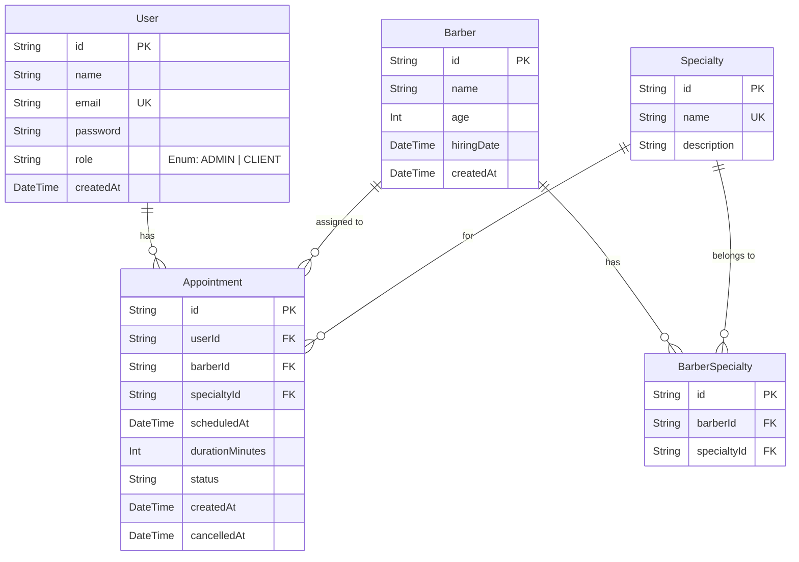

# Diagrama de Entidade-Relacionamento - ClickBeard

Este diagrama representa a estrutura do banco de dados do sistema ClickBeard.

```mermaid
erDiagram
    User {
        String id PK
        String name
        String email UK
        String password
        String role "Enum: ADMIN | CLIENT"
        DateTime createdAt
    }
    
    Barber {
        String id PK
        String name
        Int age
        DateTime hiringDate
        DateTime createdAt
    }
    
    Specialty {
        String id PK
        String name UK
        String description
    }
    
    BarberSpecialty {
        String id PK
        String barberId FK
        String specialtyId FK
    }
    
    Appointment {
        String id PK
        String userId FK
        String barberId FK
        String specialtyId FK
        DateTime scheduledAt
        Int durationMinutes
        String status
        DateTime createdAt
        DateTime cancelledAt
    }
    
    User ||--o{ Appointment : "has"
    Barber ||--o{ Appointment : "assigned to"
    Specialty ||--o{ Appointment : "for"
    
    Barber ||--o{ BarberSpecialty : "has"
    Specialty ||--o{ BarberSpecialty : "belongs to"
```
